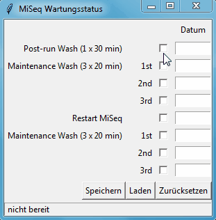

# MiSeq maintenance status GUI
> Provides an overview over the current maintenance status of an **Illumina MiSeq** sequencer

There are several steps which should be done in-between two Illumina MiSeq sequencing runs.

### After a run:
* Post-run Wash (with 0.01% Javelle in position 17)
* Maintenance Wash
* Restart MiSeq

### Just before the next run:
* Maintenance Wash

Those steps reduce run carryover contamination and increase stability of the OS.


## Background
This program was written in Python 3 with the GUI package [Tkinter](https://docs.python.org/3.4/library/tkinter.html). An executable for Windows was generated with [PyInstaller](http://www.pyinstaller.org/). That way it can be used as stand-alone executable on the MiSeq sequencer itself.  
The status can be saved and retrieved by writing or reading the  status.csv file.


## Motivation

We have two MiSeq sequencers from Illumina in our lab and several users for them. In order to keep track of the status of each sequencer, this GUI was developed.  
It should give the user a quck overview what has already been done and what still needs to be done before the next sequencing run.

## Usage
A shortcut to the software is located on the Desktop of the MiSeq sequencers (source path of .exe and .csv: C:\Users\subuser\Documents\maintenance_status).  
On the upper part of the GUI is a list with all steps. Each of them can be checked if they're completed. If you check a box, the current date appears in the entry-widget next to it (can also be manually changed).  

Before you quit the GUI (e. g. for the restart) the current status should be saved ("Speichern"). There is only one status.csv file which is always overwritten. If you open the GUI again, the latest saved status can be retrieved by using the "Laden" button.  
All the fields can be cleared by pressing the "Zurücksetzen" button (the status.csv file won't be affected by that).



## Update the executable
If a new *maintenance_status.py* file is generated, the executable can be packaged as follows:  
Under Windows (**Python 3.4** and **PyInstaller** installed)  
```
pyinstaller -w -F -i maintenance_status.ico maintenance_status.py
```

> `-w` Do not provide a console window for standard i/o.  
`-F` Create a one-file bundled executable.  
`-i <FILE.ico>` Apply that icon to a Windows executable.


## The Icon

Last but not least the icon of course. Due to the high level of excitement from [@mihuber](https://github.com/mihuber) towards GUIs with nice icons, a wave icon was chosen from the website [IconArchive](http://www.iconarchive.com/).
