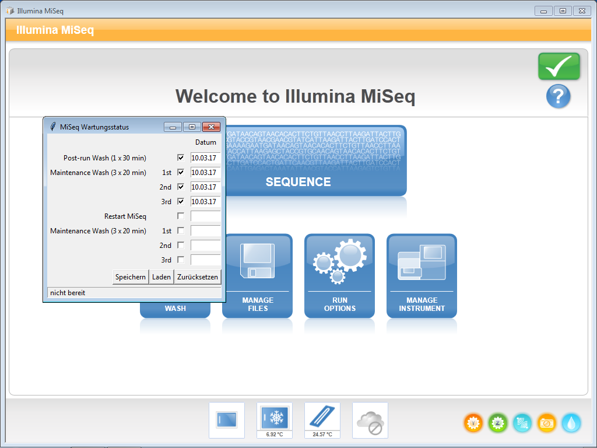

# MiSeq maintenance status GUI
> Provides an overview over the current maintenance status of an **Illumina MiSeq** sequencer

There are several steps which should be done in-between two Illumina MiSeq sequencing runs.

### After a run:
* Post-run Wash (with 0.01% Javelle in position 17)
* Maintenance Wash
* Restart MiSeq

### Just before the next run:
* Maintenance Wash

Those steps reduce run carryover contamination and increase stability of the OS.


## Background
This program was written in Python 3 with the GUI package [Tkinter]("https://docs.python.org/3.4/library/tkinter.html"). An executable for Windows was generated with [PyInstaller]("http://www.pyinstaller.org/"). That way it can be used as stand-alone executable on the MiSeq sequencer itself.



<!---
## Motivation

The initial idea to create this project

The goal of this GUI is to give the MiSeq users a quick overview what has already
been done and what still needs to be done before the next sequencing run.

## Usage
*(Include description how to use it)*
--->

## Update the executable
If a new *maintenance_status.py* file is generated, the executable can be packaged as follows:  
Under Windows (**Python 3.4** and **PyInstaller** installed)  
```
pyinstaller -w -F -i maintenance_status.ico maintenance_status.py
```

> `-w` "Do not provide a console window for standard i/o."

> `-F` "Create a one-file bundled executable."

> `-i <FILE.ico>` "Apply that icon to a Windows executable."


## The Icon

Last but not least the icon of course. Due to the high level of excitement from [@mihuber]("https://github.com/mihuber") towards GUIs with nice icons, a wave icon was chosen from the website [IconArchive]("http://www.iconarchive.com/").
